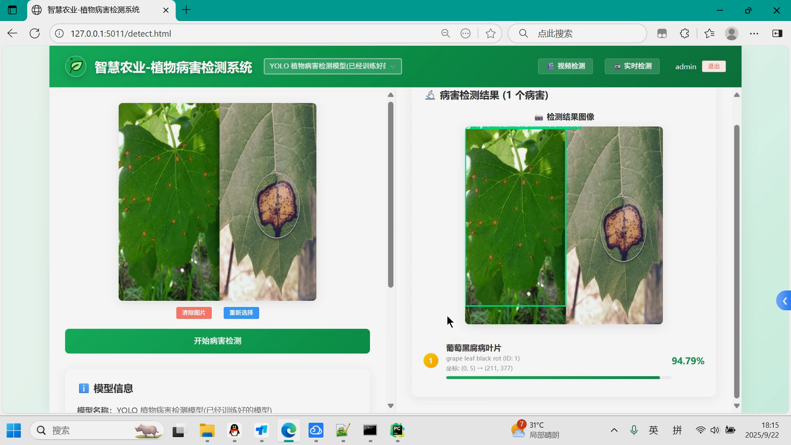

## 计算机毕业设计YOLO+AI大模型智慧农业植物病害识别检测系统 农作物病害识别检测系统 (源码+LW+PPT+讲解)

## 要求
### 源码有偿！一套(论文 PPT 源码+sql脚本+教程)

### 
### 加好友前帮忙start一下，并备注github有偿26病害识别
### 我的QQ号是1679232425 或者798059319或者2827724252 或者微信:biyesheji1698 或者 bysj2023nb

# 

### 加qq好友说明（被部分 网友整得心力交瘁）：
    1.加好友务必按照格式备注
    2.避免浪费各自的时间！
    3.当“客服”不容易，repo 主是体面人，不爆粗，性格好，文明人。
## 主要功能 

```
1. 系统概述
----------
本系统是一个基于深度学习的智慧农业植物病害检测系统，采用YOLO模型对植物叶片进行病害识别与定位。系统能够检测和识别植物叶片中的各类病害，包括苹果黑星病、番茄早疫病、玉米叶枯病、马铃薯晚疫病等30种常见植物病害，并提供精确的边界框标注和置信度评分，助力农业智能化发展。

2. 主要功能
----------
2.1 用户管理
- 用户登录：支持用户名密码登录
- 用户注册：新用户可注册账号
- 账户验证：确保系统安全性

2.2 植物病害检测
- 图像检测：支持本地植物图像文件上传检测
- 视频检测：支持本地视频文件逐帧检测分析
- 实时摄像头检测：通过摄像头实时拍摄植物进行病害检测
- 结果展示：显示检测框、病害类别（中英文）及置信度
- 统计分析：提供详细的检测统计和分析结果
- 多模型支持：提供已训练模型和新训练模型两种选择

2.3 模型数据查看
- 训练数据展示：查看模型训练过程中的数据和指标
- 验证结果展示：查看模型在测试集上的性能表现
- 精度统计：展示模型检测精度、mAP等关键指标

```


## 运行视频
https://www.bilibili.com/video/BV16LnwzkEbp

## 运行截图




